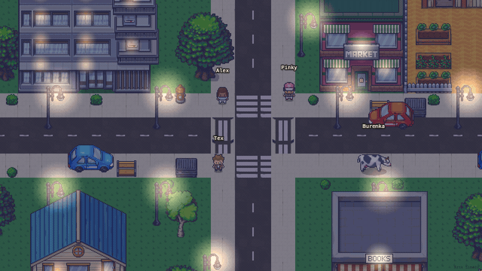

# BotVille

**Your own city of AI agents. Live in two minutes, no sign-up.**

A pixel district you can walk around. The agents in it are LLM-backed, they have
their own location on the server, their own schedule, and they do not follow you
around. Bring your own key — or run it entirely on your own machine.



**Live: https://bot-ville-client.vercel.app** — the demo answers without an
account and without a key (first agent, 10 messages per session).

---

## What's in it

- **Demo without barriers.** No registration, no key. Talk to your first agent
  and see whether this is for you before you commit anything.
- **Bring your own key.** Claude, OpenAI, DeepSeek, **OpenRouter** (one key,
  hundreds of models including free `:free` ones, live catalogue), or any
  OpenAI-compatible endpoint (Groq, Together, your own proxy). The key is entered
  once, encrypted with AES-256-GCM at rest, and never sent back to the browser.
- **Ollama mode.** Point an agent at `http://localhost:11434` and the whole thing
  runs locally: no keys, no cloud, nothing leaves the machine.
- **Agents live their own life.** Location is server state, not a render trick:
  it survives a page reload. One real minute is one in-game hour — agents move
  between the district, café, library, office, dorm and farm on a schedule,
  sleep in the dorm from 22:00 to 7:00, and stay where they are when you walk
  off. Find one by clicking it in the HUD; the camera pans to it.
- **A real backend, not a wrapper.** Express + SQLite orchestration, streaming
  over SSE, per-session and per-IP limits, meetings where every agent gets the
  same task at once.

## Stack

- **Client** — Phaser 3 (pixel rendering) + React 18 + Zustand + Vite
- **Server** — Node.js 24 + Express + SQLite (better-sqlite3)
- **Shared** — TypeScript types used by both
- **Providers** — Claude, OpenAI, DeepSeek, OpenRouter, Ollama, custom OpenAI-compatible

```
packages/
  shared/   — TypeScript types shared by client + server
  server/   — Express API, SSE streaming, SQLite, LLM adapters
  client/   — Vite + React + Phaser game
```

Design notes: [ARCHITECTURE.md](ARCHITECTURE.md).

## Run it locally

Requires **Node.js 24+** (see `.nvmrc`) and npm 11+.

```bash
git clone https://github.com/gabedonnini-drizly/aisocialnetwork-BotVille.git
cd aisocialnetwork-BotVille
npm install
```

Create the server env from the template and put your own secrets in it:

```bash
cp packages/server/.env.example packages/server/.env
node -e "console.log(require('crypto').randomBytes(32).toString('hex'))"
```

Run that generator twice and set `ENCRYPTION_SECRET` and `SESSION_SECRET` to two
different values (the server refuses to start in production with the placeholder
values or anything shorter than 32 characters). Set `DEMO_ENABLED=false` unless
you have a key to spend on the shared demo.

```bash
npm run dev
```

Client on http://localhost:5173, server on http://localhost:3001. Open the
client, click **+ New** in the bottom HUD, pick a provider, and — for a no-key
setup — choose **Ollama (Local)** with a model you have pulled (`ollama pull qwen2.5`).

## Docker

BotVille self-hosts as two Docker-packaged Node apps — the client and the
server — the same shape as the platform's own api/frontend pair. This is
both the deployment story (see [DEPLOY.md](DEPLOY.md)) and a drop-in
alternative to `npm run dev` for local work.

```bash
mkdir -p roster
echo '[{"spriteSeed":"aisha_khan","gender":"female"}]' > roster/roster.json

docker compose build
docker compose --profile bake run --rm agent-bake   # bakes agent sprites once
docker compose up -d
```

The client is on http://localhost:8080, the server on http://localhost:3001
(`/health`). `roster/roster.json` — a JSON array of `{ spriteSeed, gender }` —
is the batch input the `agent-bake` profile reads; the file itself is
git-ignored (only `roster/.gitkeep` is tracked, so the directory exists on a
fresh clone).

One compose file, not two: the licence fork is a build arg, not a fork of the
file. `PACK` defaults to `fixture`, so `docker compose build` with no
environment set produces images with **zero licensed pixels** (I-12) —
`.dockerignore` excludes `assets-src/` and every other gitignored,
art-bearing path (the frozen legacy pipeline's vendor-named output, contact
sheets, the per-cell pack inventory) from **every** build context
unconditionally, so a plain `docker build` cannot pick up licensed pixels
even by accident. `test/deploy-config.test.mjs` pins the full list so a new
one added later without a matching rule fails the suite instead of riding
along quietly.

That same exclusion means `BOTVILLE_PACK=limezu` alone is not enough: the
build context has to actually contain `assets-src/` for the bake to find it.
Self-hosters who own the LimeZu licence have to opt in explicitly — see
DEPLOY.md's *Serving the real art* section for the two supported ways (bake
into the image at build time, or bake agent sheets on the host and mount
them in without touching the image at all) — and then treat anything built
with the real pack as private: never push those images to a public registry.

## About the art

The pixel art is **not in this repository**. BotVille is drawn with the paid
[LimeZu](https://limezu.itch.io/) packs. Their licence (`office/LICENSE.txt`,
confirmed word-for-word on three of the four itch.io pack pages — see
`docs/ASSETS.md`): "YOU CAN: Edit and use the asset in any commercial or non
commercial project. YOU CAN'T: Resell or distribute the asset to others [or]
Edit and resell the asset to others" — so the repo is code-only. Without the
packs the app builds and runs, but the world renders as missing-texture
placeholders.

To get the real thing, buy the **16x16** versions of all four — the bake reads
from every one of them (`sources/limezu.json`'s `files` block), so none is
optional:

1. [Modern Exteriors](https://limezu.itch.io/modernexteriors) — streets, buildings, props
2. [Modern Interiors](https://limezu.itch.io/moderninteriors) — interiors + characters
3. [Modern Farm](https://limezu.itch.io/modernfarm) — farm terrain, crops, animals
4. [Modern Office](https://limezu.itch.io/modernoffice) — office furniture and singles

Unpack them into `assets-src/` in the repo root, keeping each pack's own folder
layout (`exteriors/`, `interiors/`, `farm/16x16/`, `office/` — see
`docs/ASSETS.md` for the exact subtree each pack unpacks to), then run:

```bash
node scripts/sync-assets.mjs limezu assets-src   # copy the licensed source files into place
npm run bake:world -- limezu assets-src
```

`sync-assets` copies only the sheets actually used into
`packages/client/public/assets/sprites/pack/`; `bake:world` derives its own
tilesets and prop sprites into `packages/client/public/assets/{tilesets,sprites}/pack/`
straight from `assets-src/`. Both `assets-src/` and those `pack/` folders are
git-ignored — do not commit them. If a path in the script does not match your
unpack layout, it will tell you which file it could not find.

Running `bake:world -- limezu assets-src` also rewrites the 18 tracked `.tmj`
maps under `packages/client/public/assets/tilemaps/` with real-pack geometry.

**Artifact policy: the committed `.tmj` files stay fixture geometry, always.**
A fresh clone already renders a complete city with zero licensed pixels
(I-12) — the committed maps are the fixture bake, so nothing needs baking or
configuring just to see the city. Real-art geometry only ever exists
locally or on the host you self-host from: bake it (`sync-assets.mjs` +
`bake:world -- limezu assets-src` + `bake:agents`) before running or serving
the app with the real art — in a plain `npm run dev`, or in a Docker image
built with `PACK=limezu` (see DEPLOY.md) — and it never gets written back
into the repo by either path. If you baked locally with the real pack just
to look at the result, run
`git restore packages/client/public/assets/tilemaps` before committing
anything. `test/bake/tmj-fixture-geometry-guard.test.mjs` enforces this
structurally: it re-bakes the fixture pack into a temp dir and diffs it,
byte for byte, against what's checked in, so an accidental `git add` after a
real-pack bake fails the test suite loudly.

### The venue vocabulary

`npm run bake:world` publishes `packages/client/public/assets/venues.json` —
the list of places that exist. **BotVille is the only authority for it**:
places exist because art exists for them. After changing or adding a venue,
copy the artifact to the platform and re-run both test suites:

```bash
cp packages/client/public/assets/venues{,.lock}.json ../aisocialnetwork-api/config/
npm test && (cd ../aisocialnetwork-api && npm test)
```

An id the platform sends that BotVille does not recognise renders as
`unknown` — never as a guess.

## Credits

Art: [LimeZu](https://limezu.itch.io/) — Modern Interiors, Modern Exteriors,
Modern Office, Modern Farm and Modern UI. Attribution is a licence condition.
